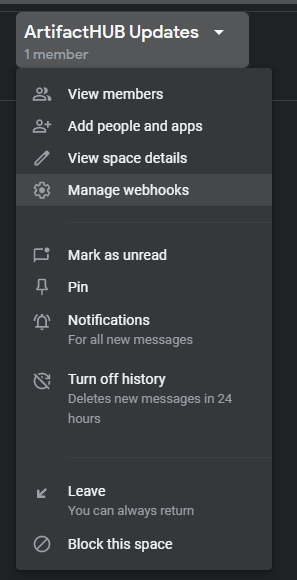
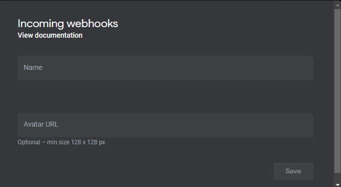
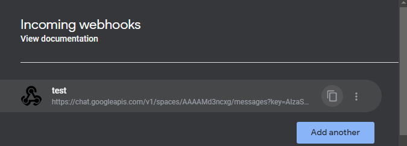
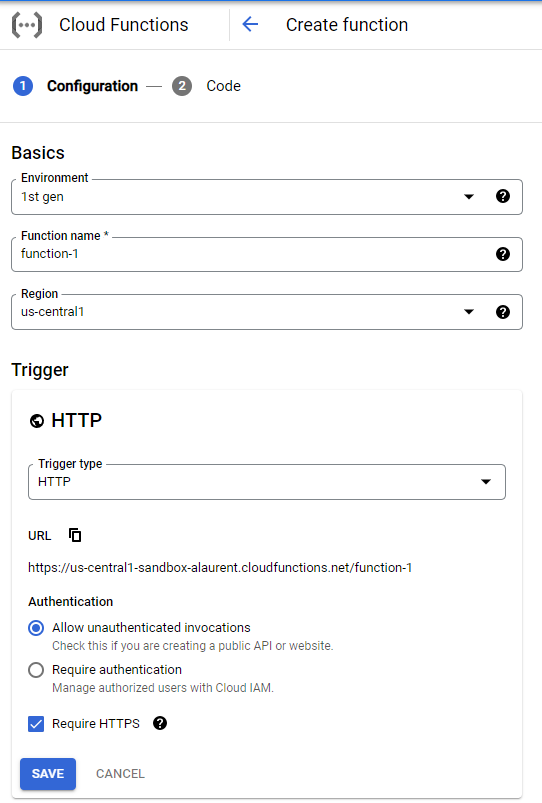
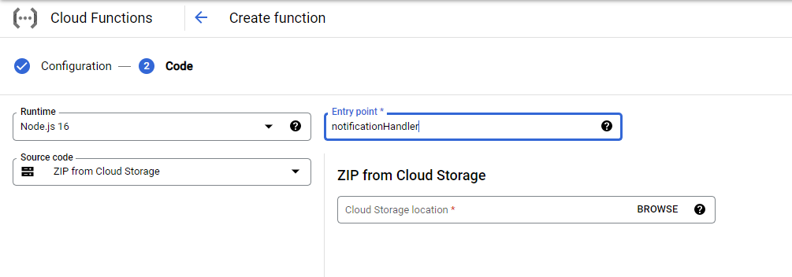
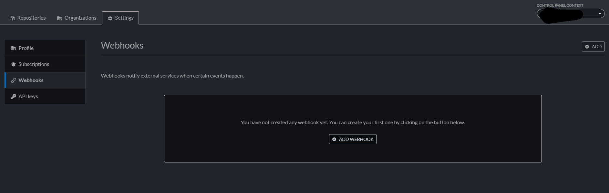
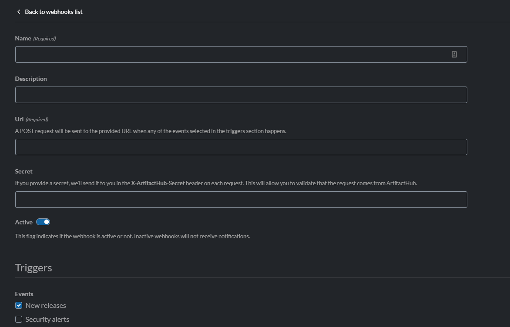
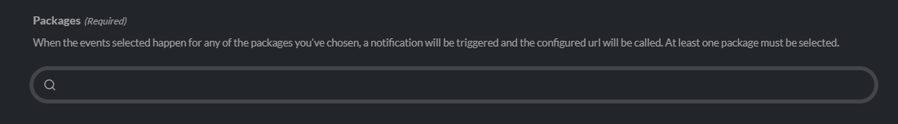

# ArtifactHUB Google Chat Notifications
A simple Go Google Cloud Function that handles ArtifactHUB Webhooks and relays them to a Google Chat space. 

# Setup

## Create a Google Chat webhook

### 1. (Optional) Create a new room for testing

### 2. Select the "Configure webhooks" menu:



### 3. Create the new webhook



### 4. Copy the webhook url



## Create Cloud Functions

### 1. Create new Google Cloud Functions



### 2. Select Google Cloud Storage ZIP source that points to the sourcecode and set the HTTP endpoint to notificationHandler



### 3. Retreive the Cloud Functions Webhook URL


## ArtifactHUB Setup

### 1. Go to Settings Webhook



### 2. Create the Webhook and Paste the Cloud function HTTP Trigger url in the URL Post Section



### 3. Add the Packages you want notifications about in the Packages section



### 4. Click add to create the Webhook

# Local Development

Don't forget to set the following env variables !


```
export FUNCTION_TARGET=NotificationHandler
export WEBHOOK_URL=https://chat.googleapis.com/v1/spaces/AAA...AAA/messages?key=BBB...BBB

```
export FUNCTION_TARGET=NotificationHandler

export WEBHOOK_URL=https://chat.googleapis.com/v1/spaces/AAA...AAA/messages?key=BBB...BBB

The function used the cloud functions sdk.
You can run it like so:

```
cd cmd
go build
./cmd
```